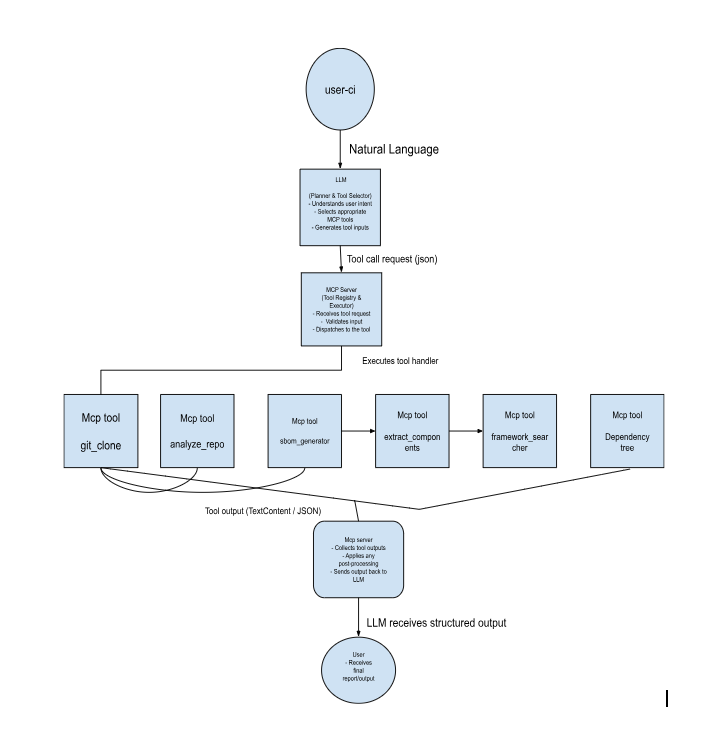

# Context Graph MCP Tools

## Introduction

**Context Graph** is an automated system built using **Model Context Protocol (MCP) tools** to analyze software repositories and provide a structured, traceable understanding of their technology stack.  

The system identifies programming languages, frameworks, and dependencies in a repository, generating outputs that are reliable and reproducible. Instead of a tightly coupled pipeline, Context Graph uses **modular MCP tools**, each performing a specific task.  

> **Note:** Currently, automated orchestration is manual—tools run independently—but the README explains the intended flow.

---

## Architecture and Orchestration Overview

The **Context Graph architecture**:

1. **clone repo** - frist clone repo.
2. **Repository Inspection** – Detect programming languages and package managers.
3. **SBOM Generation** – Generate a Software Bill of Materials using `cdxgen`.
4. **Framework Extraction** – Parse the SBOM to identify frameworks and key components.
5. **Framework Usage Search** – Locate framework usage in source code.
6. **Dependency Tree Generation** – Build dependency trees per ecosystem and validate against SBOM.

This creates an **end-to-end workflow** that transforms a raw repository into a structured representation of technologies and dependencies.  

---

## Orchestration Flow

The tools can be used in the following **sequence** to emulate full orchestration:

| Step | MCP Tool | Purpose | Input | Output |
|------|----------|---------|-------|--------|
| 1 | `clone_repo` | Clone repository and prepare orchestration directory | Git URL, @branch | `repo_path`, `orchestration_root` |
| 2 | `analyze_repo` | Detect languages, package managers, OS | `repo_path`, `orchestration_root`, `report_file` | `repo_path`, `report_file`, `orchestration_root`, `os_type` |
| 3 | `generate_sbom` | Generate standardized SBOM | `repo_path` | `repo_path`, `sbom_file` |
| 4 | `extract_sbom_components` | Extract frameworks and libraries | `repo_path`, `orchestration_root`, `report_file` | `repo_path`, `orchestration_root`, `report_file` |
| 5 | `search_frameworks` | Locate framework usage in source code | `repo_path`, `orchestration_root`, `report_file`, `output_file` | `repo_path`, `orchestration_root`, `report_file`, `sbom_output_file` |
| 6 | `generate_dependency_tree` | Generate dependency trees per ecosystem | `repo_path`, `orchestration_root`, `report_file`, `output_root` | `repo_path`, `orchestration_root`, `report_file`, `output_root` |

> Each step builds upon the **clone_repo** step's outputs. For example, `analyze_repo` requires the repo cloned by `clone_repo`.

---

## Project Structure
.
├── .env
├── images/
│   └── architecture.png
├── both_supports
├── generate_dependency_tree
├── linux_flow
│   ├── __pycache__
│   ├── repo_analyzer.py
│   └── search_framework.py
├── llm
│   ├── __pycache__
│   ├── __init__.py
│   ├── base.py
│   ├── config.json
│   ├── factory.py
│   ├── main.py
│   ├── openai_client.py
│   └── servers_config.json
├── mcp_analysis
├── mcp_servers
│   ├── tools
│   │   ├── __pycache__
│   │   ├── analyzer_repo.py
│   │   ├── extract_components.py
│   │   ├── framework.py
│   │   ├── git_clone.py
│   │   ├── sbom.py
│   │   ├── tree.py
│   │   └── server.py
├── python_flow
├── Dockerfile
├── main.py
├── MCP_README.md
├── pyproject.toml
└── README.md

----

## MCP Tools Details

### 1. Repository Cloning (`clone_repo`)
- **Purpose:** Prepare workspace
- **Outputs:** Repo path, orchestration root
- **Outcome:** Consistent workspace for downstream analysis

### 2. Repository Analysis (`analyze_repo`)
- **Purpose:** Detect languages, package managers, OS
- **Logic:** Linux → `RepoAnalyzer`; Others → `LanguageDependencyAnalyzer`
- **Outputs:** Analysis report, OS type
- **Outcome:** Technology foundation for SBOM

### 3. SBOM Generation (`generate_sbom`)
- **Purpose:** Generate `sbom.json` using `cdxgen`
- **Outputs:** SBOM file path
- **Outcome:** Standardized dependency inventory

### 4. SBOM Component Extraction (`extract_sbom_components`)
- **Purpose:** Extract frameworks and libraries from SBOM
- **Outputs:** Consolidated SBOM component report
- **Outcome:** Usable component inventory for further analysis

### 5. Framework Usage Search (`search_frameworks`)
- **Purpose:** Trace frameworks to actual source code
- **Outputs:** Framework usage report, intermediate SBOM output
- **Outcome:** Traceable mapping of frameworks to code

### 6. Dependency Tree Generation (`generate_dependency_tree`)
- **Purpose:** Generate dependency trees per ecosystem
- **Outputs:** Dependency tree reports
- **Outcome:** Validated dependency structures, cross-verified with SBOM

---


## Example Orchestration Workflow (Manual)

```bash

# Step 1: Start the orchestration (interactive mode)
python llm/main.py

# Output:
# 2025-12-29 19:59:50,787 - INFO - Initialized server: context-graph
#
# Available tools:
# - clone_repo
# - analyze_repo
# - generate_sbom
# - extract_sbom_components
# - search_frameworks
# - generate_dependency_tree
```

Once the orchestration server is initialized, you can call a specific MCP tool interactively. For example:

You: clone_repo https://github.com/example/project.git
# Output: Confirmation that the repo was cloned, and the absolute repo path

You: analyze_repo
# Output: Analysis report generated, including repo path, orchestration root, and OS type

You: generate_sbom
# Output: SBOM generated for the repository

You: extract_sbom_components
# Output: SBOM components report generated

You: search_frameworks
# Output: Framework usage report generated

You: generate_dependency_tree
# Output: Dependency tree report generated


## Architecture Diagram

The following diagram illustrates the flow from user input to LLM processing, MCP tool execution, and final output:



## Detailed Document

[View Detailed Documentation (Google Docs)](https://docs.google.com/document/d/1wmagdF-qQBTWKDI18XcxD3IMXe6BQDw7tyN6usU8MYE/edit?tab=t.0)


